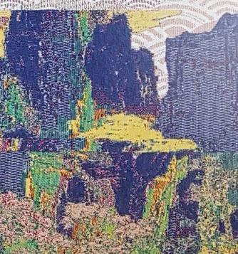

# mythic-ountain｜變奏仙山

以山脈圖片作為辨識目標的網頁 AR 作品。偵測成功後，畫面會出現 47 隻只由翅膀構成的
蝴蝶，並以 57 種翅膀變奏、不同大小與獨立揮翅節奏呈現群飛效果。

## AR 頁面

- AR 頁面網址：<https://2023k-work.github.io/mythic-ountain/ar.html>
- 專案首頁：<https://2023k-work.github.io/mythic-ountain/>

<p align="center">
  
</p>

## Asset 掃描圖片

已從原始 Asset 提取 M1 至 M5 共 5 張掃描圖片。請注意，目前 AR 辨識程式已啟用的目標仍為
M1；M2 至 M5 已整理到專案中，後續可再編譯為多目標辨識資料。

<table>
  <tr>
    <td align="center"><strong>M1</strong><br /></td>
    <td align="center"><strong>M2</strong><br /></td>
  </tr>
  <tr>
    <td align="center"><strong>M3</strong><br /></td>
    <td align="center"><strong>M4</strong><br /></td>
  </tr>
  <tr>
    <td align="center"><strong>M5</strong><br /></td>
    <td></td>
  </tr>
</table>

## 使用說明

### 使用手機體驗

1. 使用手機的 Safari 或 Chrome 開啟上方 AR 頁面網址。
2. 允許瀏覽器使用相機；頁面進入後會自動啟動相機。
3. 將手機對準上方的 M1 山脈圖片，等待蝴蝶逐漸浮現。
4. 偵測成功後，點擊一次相機畫面，全部蝴蝶會朝手機後方以圓錐狀方向擴散飛離。
5. 蝴蝶飛離後不會自動回來；重新掃描 M1 圖片才會重置。

### 本機執行

```powershell
npm install
npm run dev
```

手機測試時，請使用終端機顯示的 HTTPS 區域網路網址，例如：
`https://192.168.1.197:5173/ar.html`。第一次開啟可能會遇到自簽憑證警告，請允許繼續存取；
HTTP 網址無法使用手機相機。

### 更新 GitHub Pages

修改程式後，請以 GitHub Pages 的專案路徑重新建置，再將建置結果同步到 `docs/`：

```powershell
$env:VITE_BASE_PATH = '/mythic-ountain/'
npm run build
Remove-Item Env:VITE_BASE_PATH
```

將 `dist/` 內容複製到 `docs/` 後提交並推送至 `main`，GitHub Pages 就會更新網站。
